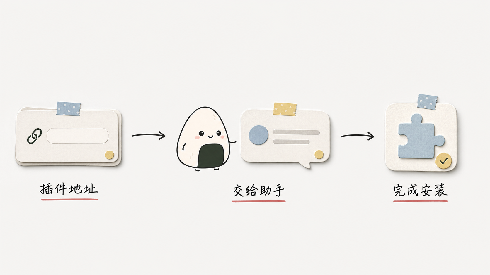
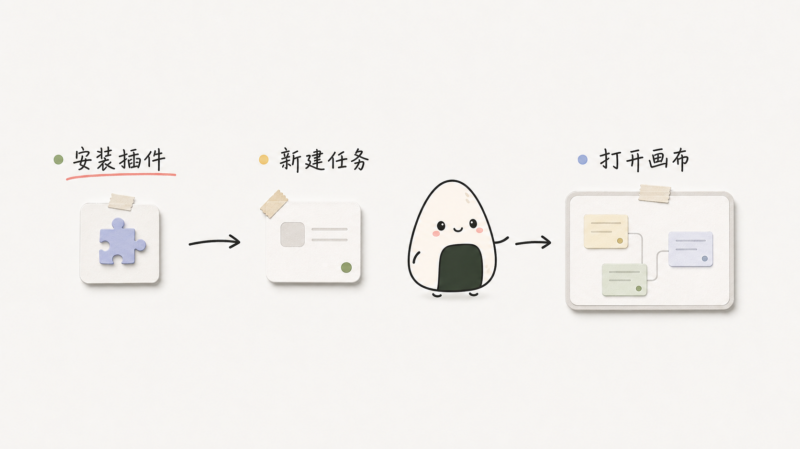
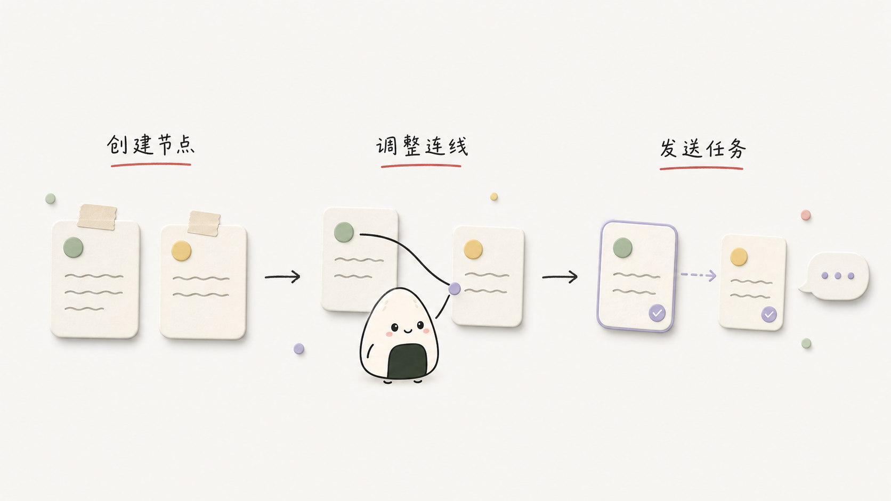
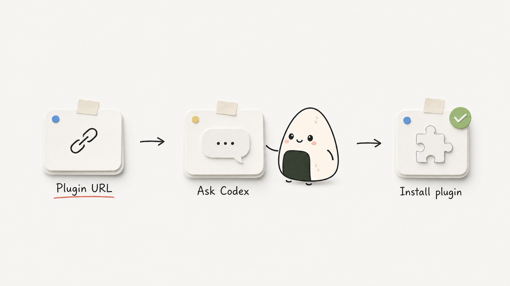
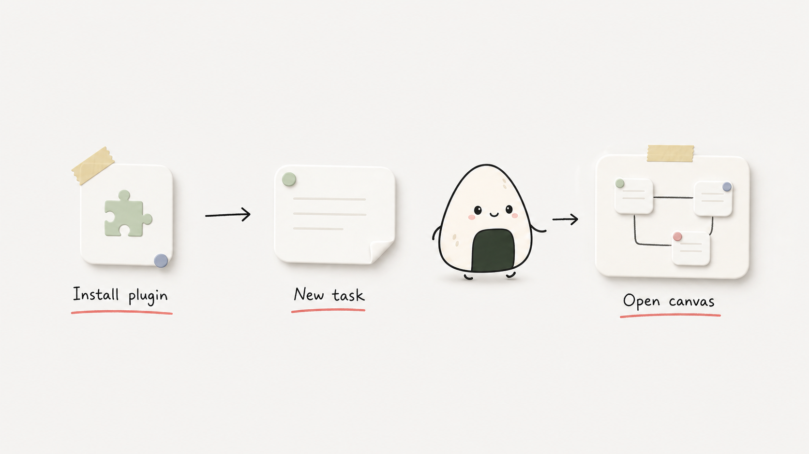
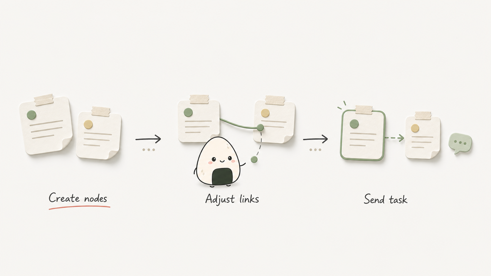

# Canvasight

Language / 语言: [中文](#中文) | [English](#english)

---

## 中文

Canvasight 是一个 repo-local Codex 插件，用可编辑画布组织任务、附件和提示词流程。正常使用时，画布直接渲染在 Codex 原生 widget 中；项目级本地 daemon 负责画布数据和 API，不依赖某个任务持续运行。

### 许可证

Canvasight 以 [MIT License](LICENSE) 开源，Copyright (c) 2026 Niall Young。

画布归属与 Run 投递是两套独立的绑定：画布内容跟随项目文件夹，保存为该项目的 `.scatter/scatter.json`（附件在 `.scatter/assets/`）；每次打开则以**当前 Codex 任务**临时绑定 native widget 和 Run。切换到另一个项目后，Canvasight 必须重新解析该任务的项目目录并加载那个目录的 `.scatter`，不能因为先前任务或最近项目记录而复用旧项目画布或旧任务作为 Run 目标。

### 主要功能

- 创建、拖拽、复制、删除和连接任务节点。
- 使用多个 Page 隔离同一项目中的不同画布工作区。
- 多个 Codex 任务可以同时编辑同一项目：不同对象自动合并，同一对象冲突时保留完整冲突副本。
- 给节点添加图片、文件和上下文附件。
- 节点始终通过 Chat 发送当前节点及其下游节点到当前 Codex 任务。
- 通过 `write_canvasight_graph` 让 Codex 创建或更新可编辑的 Page、节点和连线。
- 保存和复用本机全局节点模板；模板库最多保存 200 个模板，不会静默淘汰旧数据。
- 从新 Codex 任务恢复最近使用的 Canvasight 项目。
- 可选地在 Run Markdown 中加入 Agent Team 协作协议：以 `ROSTER.md` 恢复角色席位、以版本化报告维护唯一 owner 与验证证据，并从报告派生 `agent-reports/QUEUE.md`。
- 在节点正文输入 `$` 搜索当前项目启用的 Skill；也可让专业 Skill 主导一次画布内容生成，或在显式开启后让 AI 为职责明确的节点选择 Skill。

### 基础用法

1. **安装插件。** 复制下面这句话，粘贴并发送给 Codex：

   ```text
   帮我从 stable 分支安装这个 Codex plugin：https://github.com/Niall-Young/Canvasight.git
   ```

   Codex 会完成 marketplace 和插件安装。如果你想手动运行 CLI，或者需要从本地 checkout 安装，请参阅后面的[插件安装](#插件安装)。

   

2. **让 Codex 加载插件。** 安装、重装或升级后，重新加载 Codex 窗口或完全重启 Codex；然后打开要使用 Canvasight 的项目，新建一个 Codex 任务，并在任务中 `@Canvasight`。

3. **打开画布。** 把下面这段提示词完整复制到 Codex：

   ```text
   @Canvasight 打开当前项目的 Canvasight 画布。请使用当前任务的项目目录，并在原生画布确认就绪后再告诉我。
   ```

   

4. **创建画布内容。** 画布打开后，选择一个适合当前工作的提示词复制到 Codex：

   分析代码项目：

   ```text
   用 Canvasight 分析当前项目，并创建一个“代码架构”Page。按照真实目录、核心模块、数据流、接口、风险和验证方式拆成可编辑节点，用有实际含义的连线表达它们的关系。
   ```

   规划产品需求：

   ```text
   用 Canvasight 把下面的产品需求创建成一个可执行的画布：包含产品目标、目标用户、核心流程、范围边界、设计方向、技术实现、风险和验收标准。请拆成可编辑节点，并用连线表示真实依赖关系。

   产品需求：
   在这里粘贴你的需求
   ```

   整理文章或资料：

   ```text
   用 Canvasight 把下面的内容整理成一个新的 Page。按照主题、章节、核心观点、证据、结论和待确认问题创建可编辑节点；只有存在真实包含、证据或依赖关系时才连接节点。

   内容：
   在这里粘贴文章或资料
   ```

5. **继续修改当前画布。** 复制下面的提示词，并把方括号中的内容换成你的要求：

   ```text
   继续完善当前 Canvasight Page：请保留未提及的节点和位置，只更新与“[在这里写要补充、修改或删除的内容]”有关的节点和连线。
   ```

6. **编辑并运行。** 你可以继续在画布中拖拽节点、修改文字、添加附件、连接节点或切换 Page。在节点正文输入 `$` 会搜索当前项目启用的 Skill，选择后插入可见、可复制的 `$skill-name`；列表不可用时仍可直接输入。准备好后，在要执行的节点上点击 Run；Canvasight 会把该节点及其下游节点作为 Chat 消息发送到当前 Codex 任务，并说明每个节点级 Skill 只负责对应节点。

   

### 并发编辑

同一项目可以在多个 Codex 任务中同时打开和编辑。同一 Page 上的保存会以各任务最后确认的版本为基础进行比较：不同节点或连线的修改会自动合并，不需要锁住整个 Page。

如果两个任务修改了同一对象且结果不同，原 Page 保留先保存的结果；后保存任务的完整 Page 会保存为一个新的“冲突副本” Page。删除与修改发生冲突时也会创建冲突副本，不会把任一方的内容静默丢弃。后保存的任务会在本地切换到这个冲突副本并显示提示，其他任务不会被强制切换 Page。冲突副本之后就是普通 Page，可以继续编辑、重命名或删除。

AI 开始修改当前 Page 时，Canvasight 会把这次写入绑定到当时的 Page 和上下文。你可以在 AI 工作期间继续拖动节点、编辑其他内容或切换 Page；不同对象的修改会自动合并，切换 Page 也不会让 AI 写到错误的页面。已有节点保留你最新的手动位置，AI 只为新增节点安排位置。

如果你和 AI 修改了同一个节点、连线或 Page 信息，你的内容和手动位置会保留在原 Page，经过验证的完整 AI 结果则保存为“AI 冲突副本”。如果原 Page 已被删除，Canvasight 会把 AI 结果保存为“AI 恢复副本”，不会擅自恢复已删除的 Page。提示会持续显示“你正在编辑的版本已保留，AI 结果已保存为冲突副本”，并提供“查看 AI 版本”；Canvasight 不会自动切换当前 Page。

图结构和 framework 校验始终在自动重基前完成。支持新并发合同的 AI 写入可以安全合并或保存副本；不带有效上下文的旧客户端继续使用严格的 revision 校验，过期写入仍会返回错误而不会覆盖新内容。

### 原生 widget 合同

- React shell 在 widget 第一帧立即挂载；启动过程使用单调状态机 `starting → connecting_bridge → connecting_session → hydrating_project → ready | failed`。重复或乱序的 `tool-result` / `openai:set_globals` 只能确认当前进度，不能把 Ready 回退为 Connecting，也不能让失败的 attempt 恢复。
- 每个 widget 客户端生成唯一 `widgetInstanceId`。只有与 `openAttemptId`、`sessionId`、`threadId` 同时匹配的 fullscreen instance 能满足 ready；hidden、inline 和 browser renderer 只能上报诊断。
- widget 通过 app-only `canvasight_widget_api` 访问 daemon，并在请求中携带 attempt、instance 和当前 startup stage。原生 widget 不直接 fetch localhost。
- Codex 复用已打开的 widget 容器时，新的 open binding 会在同一容器中重新启动 React 应用、停用旧任务画布并绑定新的 attempt/session/thread。当前 binding 的重复元数据可以合并；更旧 binding 的迟到元数据必须忽略，不能让 Ready 回退到 Connecting。
- 启动失败、阶段超时或 React render error 会进入持久失败面板，显示失败阶段和可读原因，并提供重新连接、在新任务中重开和复制脱敏诊断；不能永久停在 “Opening”、“Starting” 或 “Connecting”。
- native Run 只允许由已验证的 fullscreen instance 以 Chat 发往绑定任务，并且只有 MCP Apps `ui/message` 或 `window.openai.sendFollowUpMessage` 的 Promise 成功后才能显示“已发送”。
- daemon URL 和 token 只存在于 widget 内部元数据，不出现在 native open 的公开结果中。

浏览器 URL 和裸 dev 页面是诊断 fallback，不是原生打开路径。它们没有 native widget host bridge：claim 当前任务后，Run 只进入 `await_canvasight_run` 队列，不能显示为 native sent。

### AI 写入画布

需要把产品需求、文章结构、代码架构或执行计划变成画布时，可以直接说：

- “用 Canvasight 把这个需求拆成任务节点。”
- “分析这个项目，并生成一个代码架构 Page。”
- “把这篇文章按论点和证据写到画布。”
- “新增一个包含调研、设计、开发和测试的 Page。”

Codex 应优先调用 `write_canvasight_graph`，不手写完整 `.scatter/scatter.json`。默认 `mode` 是 `append-page`，只有用户明确要求覆盖时才使用 `replace-active-page` 或 `replace-document`。`graphType` 只决定节点组织策略，不决定 Page 的写入方式。

当用户说“继续完善当前画布”“补充这个节点”“删除上面的分支”时，Codex 应先调用 `get_canvasight_graph_context` 读取当前 Page、`contextId`、`documentRevision` 和 `documentVersion`，再用 `merge-active-page` 提交最小的节点/连线 operations，同时传回该上下文的 revision 和可在重试时复用的稳定 mutation ID。只有“新画一张”才新增 Page，“重做当前页”才整体替换当前 Page，“全部重来”才替换整个文档。增量修改始终写回上下文捕获的 Page，不会被之后的 Page 切换重新定向。

生成内容按 intent、domain、maturity 和 output 组合选择思考框架。主要 domain 的必需内容通过非持久化 `frameworkManifest.coverage` 校验；候选画布未通过时不会写入，Codex 会根据内部 violations 修正并重新校验，最多三轮。正常交付给用户的是通过检查后的可编辑画布，不是检查问题清单。

专业内容 Skill 可以通过 Codex description 路由或用户显式 `$Skill` 主导一次写图。此时 `skill-led` 只替换默认专业内容框架：专业 Skill 负责内容，Canvasight 仍是 Page、节点、关系、revision、原子写入和固定水平布局的唯一写入者。多个专业 Skill 无法调和时必须先询问用户，不能静默混合。

节点级 Skill 是另一层能力。用户手动 `$Skill` 始终可用；“允许 AI 为节点选择 Skill”是默认关闭、跨项目生效的全局设置。开启后 AI 只在 Skill description 与节点职责明确匹配时写入 `$skill-name`，并提交来源和理由用于本次写图校验。Canvasight 不给节点增加隐藏 Skill 字段，也不提供 Skill 安装或启用管理。

写入 `software-product` 画布时，如果项目缺少 `AGENTS.md` 或 `design.md`，Canvasight 会自动补充对应的独立交付节点，不需要消耗模型重试次数。

所有 AI 创建、替换、合并和重排默认使用 `layoutPolicy: auto`，并统一采用从左到右的水平拓扑，不因 domain、output、`graphType`、文章阅读顺序或任务先后顺序产生纵向例外。Canvasight 根据最终节点关系分层、按完整子树居中并避让节点矩形；同层兄弟、并行分支和章节顺序只通过 Y 轴排序表达。对外 schema 只公开 `horizontal`；旧调用中的 `vertical` 和 `grid` 仍可作为兼容输入，但运行时会统一归一为 `horizontal` 并返回 deprecated advisory，不会按旧方向写入。

`preserve-explicit` 只用于用户明确要求保留自己手工调整的坐标，不能作为 AI 新建纵向图的入口；现有 `.scatter` Page 不会被自动迁移，只有后续 AI 拓扑修改或显式 `relayout-page` 才会按水平规则重排。并发重基时，已有节点始终保留最新的手动坐标，AI 布局只作用于新增节点。内容拆分依据职责和真实关系，而不是节点数、正文长度或固定层级；内容顺序本身不等于依赖边，文章章节、产品页面、能力、验收项和并行任务只有存在真实的依赖、包含、导航、证据或决策关系时才连接。Canvasight 会拒绝把独立职责机械串成一条超长单链；`frameworkManifest.semanticStructure` 记录覆盖节点的职责与凝聚原因，`semanticRelationships` 按最终 edge ID 记录关系类型和理由。

AI 写图前可以先用 `list_canvasight_node_templates` 扫描模板摘要，再用 `get_canvasight_node_template` 读取选中模板的完整内容。现代 AI 写入通过捕获的上下文与网页自动保存协调：过期 revision 会触发安全重基，不同对象自动合并，同一对象冲突时保留用户原 Page 并保存完整 AI 副本。旧客户端仍执行严格 revision 校验，任何路径都不能静默覆盖较新的画布。

### 插件安装

推荐先使用上面[基础用法](#基础用法)中的提示词让 Codex 安装。需要手动安装时，在终端运行：

```bash
codex plugin marketplace add https://github.com/Niall-Young/Canvasight.git --ref stable
codex plugin add canvasight@canvasight-local
codex plugin list
```

从 `0.4.10` 开始，Canvasight 发布包中的 MCP server 已包含运行所需的依赖。通过 GitHub 正常安装或升级时，插件缓存不需要 `node_modules`，用户也不需要进入缓存目录运行 `npm install` 或 `npm ci`。如果 `codex plugin list` 仍显示 `0.4.9` 或更早版本，请优先升级到 `0.4.10` 或更高版本。

`codex plugin list` 中应能看到 `canvasight@canvasight-local`。Canvasight 也支持本地 checkout：插件源码位于 `plugins/canvasight`，marketplace 配置位于 `.agents/plugins/marketplace.json`。把下面的路径换成仓库的绝对路径：

```bash
codex plugin marketplace add /你的绝对路径/Canvasight
codex plugin add canvasight@canvasight-local
codex plugin list
```

安装、重装或升级后，如果 Codex 桌面端当时正在运行，请先重新加载窗口或重启 Codex，再新建任务并重新 `@Canvasight`。只新建任务仍可能沿用桌面进程级的旧插件注册快照。`codex plugin list` 中的已解析版本应与 `plugins/canvasight/package.json` 一致。

### 检查与更新

从 `0.4.11` 开始，可以直接对 Codex 说“检查 Canvasight 更新”或“更新 Canvasight”。检查只比较当前已安装版本和官方最新正式 Release，不会安装或改动任何内容。更新会安装 Release 中的完整插件快照，包括网页界面、MCP server 与 tools、Skills、manifest、图标、静态资源和插件文档；它不是只替换更新 Skill。

已经是最新版时，Canvasight 不刷新 marketplace、不重新安装，也不提示重启。当前版本高于正式 Release、版本无法识别、来源是本地 checkout 或自定义 fork 时，更新器会安全停止，不降级、不覆盖开发目录。只有确认官方 `Niall-Young/Canvasight` 的 `stable` 来源、Release 与插件版本一致并安装验证成功后，才会报告更新完成。

更新器永远不修改项目中的 `.scatter/scatter.json`、`.scatter/assets/`、Page、节点、连线、位置和设置，也不修改 `~/.canvasight`、项目源码、其他插件或 Skills、开发者本地 checkout 和无关 Codex 配置。若未来数据格式需要升级，会使用独立的兼容迁移，而不是由通用更新器删除或重建数据。

`0.4.10` 或更早版本还没有更新 Skill。第一次升级到 `0.4.11` 需要手动运行：

```bash
codex plugin marketplace upgrade canvasight-local
codex plugin add canvasight@canvasight-local
```

真正安装新版本后，更新器只会请你自行重新加载或重启 Codex Desktop，再新建任务并重新 `@Canvasight`；它不会代替你重启、退出、新建任务或继续追踪。

### MCP Tools

原生打开与确认：

- `open_canvasight`：正常入口；返回 provisional `opening`、`openAttemptId` 和 `sessionId`，不代表画布已打开。
- `render_canvasight_canvas_widget`：显式 widget 兼容入口。
- `open_canvasight_recent_project`：在新任务中打开最近项目。
- `list_canvasight_recent_projects`：列出最近项目。
- `await_canvasight_widget_ready`：绑定 attempt、session、任务和 fullscreen instance，等待真实 React commit、项目 hydration 与可见画布；这是 native open 的成功判定。

画布和模板：

- `get_canvasight_graph_context`
- `write_canvasight_graph`
- `list_canvasight_node_templates`
- `get_canvasight_node_template`
- `list_canvasight_skills`：按当前项目职责查询已启用 Skill 的脱敏摘要；不返回正文或本地路径。

fallback 与会话：

- `open_canvasight_browser_fallback`：只用于显式诊断或开发预览。
- `claim_canvasight_thread`：把已有 fallback session 绑定到当前任务。
- `await_canvasight_run`：领取 fallback 队列中的 Run；不用于证明 native Run 成功。
- `close_canvasight`：关闭指定 session，不停止项目级 daemon。

一次用户级打开动作必须是一次 `open_canvasight` 加一次 `await_canvasight_widget_ready`。调用方必须保留首次打开返回的完整结果，并使用其中同一组 `sessionId`、`openAttemptId` 和 `threadId` 继续校验；不能因为包装器、转录或局部变量丢失了这些字段而再次调用 `open_canvasight`。身份缺失时，本次打开保持 `unverified` 并进入故障排查，不能静默创建第二个画布。

`await_canvasight_widget_ready` 参数：

- `openAttemptId`：必填，来自 `open_canvasight`。
- `sessionId`：必填，来自 `open_canvasight`。
- `threadId`：必填，必须是调用 `open_canvasight` 时使用的当前 Codex 任务 id。
- `widgetInstanceId`：可选；调用方已观察到具体实例时，可进一步限定到该 fullscreen instance。
- `timeoutMs`：可选，范围 `1..300000`，默认 `30000`。

它返回 `status`（`ready`、`timeout` 或 `failed`）、`verified`、`openAttemptId`、`sessionId`、`threadId`、`widgetInstanceId`、`displayMode`、`stage`、`reactMounted`、`projectHydrated`、`canvasRendered`、`canvasVisible`、画布尺寸、`error` 和 `reportedAt`。只有上述 fullscreen ready 证据完整时 `verified` 才能为 true。

### Skills 分工

- `canvasight-open`：原生打开、最近项目和显式 browser fallback。
- `canvasight-run`：native Chat Run 与 fallback 队列处理。
- `canvasight-graph-writer`：用 AI 创建或更新 Page、节点和连线。
- `canvasight-agent-team`：处理可选的 Agent Team 角色注册表与 agent-report 协作协议；报告优先于 roster，队列为派生索引。
- `canvasight-update`：只读检查官方正式 Release，或安全安装完整的稳定插件快照并验证版本。
- `canvasight-troubleshooting`：处理插件、MCP transport、daemon、widget 和 fallback 故障。
- `canvasight`：跨多个 Canvasight 工作流时使用的薄索引。

专业 Skills 负责内容判断；Canvasight Skills 负责写入协议和产品工作流。画布级内容 Skill 与节点级 `$Skill` 分配是不同概念，两者都不能直接写 `.scatter` 或改变固定水平布局。

### 数据存储

- 项目画布：`.scatter/scatter.json`
- 项目附件：`.scatter/assets/`
- 最近项目、daemon 状态和生命周期日志：本机 Canvasight 用户状态目录
- 全局用户偏好：`CANVASIGHT_HOME/preferences.json`，包括默认关闭的 AI 节点 Skill 分配开关
- 全局节点模板及其资源：本机 Canvasight 用户状态目录，不写入项目文件

`.scatter/scatter.json` 保持 v1 兼容，并通过 `pages` 和 `activePageId` 支持多个 Page。未知字段应尽量保留，非法文件应显示可恢复错误，而不是清空画布。

`threadId` 不用于决定画布文件归属，也不应作为跨项目的持久“当前项目”记录；它只标识本次打开的 Codex 任务和该任务中的 Run 接收方。最近项目列表仅用于显式的“打开最近项目”，不能覆盖当前任务已解析的项目目录。

### 开发命令

从 `plugins/canvasight` 运行：

```bash
npm install
npm run build:mcp
npm run check:mcp-bundle
npm run dev
npm run dev:status
npm run dev:stop
npm run dev:foreground
npm run preview
npm run daemon
npm run daemon:stop
npm run typecheck
npm run build
npm run test:markdown
npm run test:markdown-export
npm run test:skills
npm run test:dev-server
npm run test:mcp
npm run test:concurrency
npm run test:plugin-distribution
npm run test:update
npm run test:widget-runtime
npm run diagnose:mcp
npm run release:prepare -- 0.4.16
npm run release:verify -- 0.4.16
```

`npm run build:mcp` 从 MCP 源码生成发布用的自包含 server；`npm run check:mcp-bundle` 只检查已提交 bundle 是否与源码一致。`npm run dev` 和 `npm run dev:foreground` 只用于开发预览。正常插件使用由 MCP tool 自动启动或复用项目级 daemon，不应要求用户安装依赖、生成 bundle 或先运行 dev server。

`npm run release:prepare -- <version>` 会同步发布版本并重新生成 MCP 与 Web 发布产物；`npm run release:verify -- <version>` 是不修改文件的只读发布门禁。

插件校验：

```bash
python3 /Users/niallyoung/.codex/skills/.system/plugin-creator/scripts/validate_plugin.py /Users/niallyoung/Desktop/Canvasight/plugins/canvasight
```

### 原生验收

代码改动可以先通过 typecheck、build、MCP smoke 和 plugin validation，但原生 widget 修改还必须完成真实宿主验收：

1. 安装待交付的准确插件版本。
2. 若升级发生在 Codex 运行期间，先重新加载窗口或重启 Codex；再新建任务并重新 `@Canvasight`。
3. 通过正常 `@Canvasight` / `open_canvasight` 路径打开。
4. 使用 open 返回的 `openAttemptId`、`sessionId` 和同一 `threadId` 调用 `await_canvasight_widget_ready`，确认返回已验证的 fullscreen instance，且 React、项目 hydration、canvas rendered/visible 与非零尺寸证据完整。
5. 确认完整画布可见，并实际操作至少一个有意义的画布控件。
6. 点击一个节点 Run，确认消息由同一已验证 fullscreen instance 通过 native host bridge 到达同一个 Codex 任务。
7. 等待并触发重复或乱序的 metadata / host 事件，确认可见状态不再从 Ready 回退到 Connecting。

synthetic VM、DOM mock、metadata shape、postMessage、MCP smoke、build、plugin validation 和 browser fallback 都只能作为辅助检查。缺少上述真实证据时，交付状态必须写为 `unverified`，不能声称“画布已打开”“已就绪”或“已修复”。

### 常见问题

**一直显示 Opening / Starting / Connecting 怎么办？**

先查看 `await_canvasight_widget_ready`：

- `ready`：只有 `verified: true` 且 fullscreen、React、项目 hydration 和可见画布证据完整时，原生启动才已确认。
- `timeout`：widget 没有在等待时间内完成 ready 回执；按未验证处理，查看可见启动错误、插件版本和 MCP lifecycle 日志。看到 `Connecting` 只证明 bridge 收到了 session metadata，不证明初始 API 或 ready 回执成功；daemon 尚未收到 telemetry 时，`reactMounted:false` 也不能单独证明 React 没运行。
- `failed`：根据持久失败面板和 ready 结果中的 `stage`、`error` 定位 React、bridge、fullscreen host context、session、hydration 或 canvas visibility 阶段。可以选择重新连接、在新任务中重开或复制脱敏诊断。

不要用 browser fallback、daemon health 或再次看到 tool success 来覆盖这个结论。

**Windows 安装后仍看不到 Canvasight tools？**

先用 `tool_search` 查找 `canvasight open_canvasight await_canvasight_widget_ready`，再用 `codex.cmd plugin list`（不要使用可能被 PowerShell 执行策略拦截的 `codex.ps1`）确认插件来源和已解析版本。正式修复是升级到 `0.4.10` 或更高版本；这些版本的 MCP server 自带依赖，正常 GitHub 安装不需要缓存目录中存在 `node_modules`，也不需要手工运行 npm。

如果已解析版本是 `0.4.9` 或更早版本，并且错误明确为 `ERR_MODULE_NOT_FOUND`（例如缺少 `@modelcontextprotocol/ext-apps` 或 `fflate`），可以把下面的命令作为旧缓存的临时恢复方式：先进入 `codex.cmd plugin list` 显示的 Canvasight 已安装插件根目录，再运行：

```powershell
npm.cmd ci --omit=dev
```

这不是正式修复。完成临时恢复或版本升级后，都要完全退出并重启 Codex Desktop，再新建任务并重新 `@Canvasight`；只新建任务可能仍沿用旧注册快照。不要把 browser fallback 能显示画布当作原生修复成功；仍须由 `await_canvasight_widget_ready` 返回完整的 verified fullscreen ready 证据。

如果 tools 仍缺失，问题还在 MCP 启动/注册层，不要先排查 daemon 或 widget。在已安装插件根目录运行 `node .\tests\mcp-registration-probe.mjs`；探针会检查 manifest 中的 Node 命令，完成 `initialize` 和 `tools/list`，确认必要的打开工具，并输出 Node 可执行文件、工作目录、阶段和隔离的生命周期日志位置。仓库开发环境也可运行 `npm run diagnose:mcp`。

查看 `%USERPROFILE%\.canvasight\mcp-lifecycle.log`（设置了 `CANVASIGHT_HOME` 时改看该目录）：

- 没有本次启动的 `stdio_start`：Codex Desktop 没有启动 Canvasight MCP；检查插件缓存、`.mcp.json` 和 Desktop 进程是否能解析 Node。
- 有 `stdio_start` 但没有 `request`/`initialize`：MCP 子进程已启动，但宿主没有完成握手。
- 有 `initialize` 和 `tools/list`：Canvasight MCP 已响应，继续检查当前任务的插件工具注册快照。

不要把直接运行 `node .\mcp\server.mjs` 后持续等待当成故障；stdio MCP 会等待 JSON-RPC 输入。探针只证明 MCP 握手健康，不能证明原生画布已打开。

**`Transport closed` 是什么？**

它表示当前 Codex 任务里的 Canvasight MCP transport 已关闭或过期，不等于 daemon 故障。检查 Canvasight lifecycle 日志；若插件版本未变化，可尝试重载任务，若刚安装或升级过插件则应重载/重启 Codex 宿主后再新建并重新标记任务。localhost fallback 不能修复 native transport。

**为什么 browser fallback 的 Run 没有直接发送？**

browser/dev 页面没有 native widget host bridge。用 `claim_canvasight_thread` 绑定当前任务后，它只会把 Run 放入队列，再由 `await_canvasight_run` 领取。

**Run 为什么没有出现在当前任务？**

先确认这是通过 `open_canvasight` 打开的 native widget，并且 ready 已确认。native Chat Run 以 host bridge Promise 为成功标准；fallback Run 则检查 claim 和 `await_canvasight_run`。

**Run 显示 `failed to read thread` 或 `rollout does not start with session metadata` 怎么办？**

这表示 Codex 无法读取该任务的本地 session/rollout metadata，不是节点内容错误。Canvasight 会依次选择显式配置的 runtime、Codex Desktop、ChatGPT Desktop，最后才在没有可用 Desktop runtime 时使用 PATH 中的 `codex`。只有 Codex 明确报告 task 尚未加载时，Canvasight 才会在同一连接里恢复该 task 后重试。

若诊断显示 **Desktop runtime 不可用**，重载或重启当前 Desktop 应用后重新打开 Canvasight；若显示 **线程存档不兼容**，重载或重启 Desktop 后新建 task，再重新打开 Canvasight。不要改用旧 PATH CLI、旧任务或最近任务。两种失败都会保留节点内容。Canvasight 全程不模拟鼠标/键盘、不复制粘贴、不自动新开 task，也不修改 Codex session 文件。browser fallback 和 dev 页面不能修复原生任务存储。

**新任务需要运行 `npm run dev` 吗？**

不需要。正常插件入口会自动启动或复用项目级 daemon。dev 命令只用于开发和诊断。

---

## English

Canvasight is a repo-local Codex plugin for organizing tasks, attachments, and prompt flows on an editable canvas. In normal use, the canvas renders directly inside a Codex native widget. A project-level local daemon serves canvas data and APIs independently of any single task.

### License

Canvasight is open source under the [MIT License](LICENSE), Copyright (c) 2026 Niall Young.

Canvas ownership and Run delivery are separate bindings: canvas content follows the project folder and is stored in that project's `.scatter/scatter.json` (with attachments in `.scatter/assets/`); each open temporarily binds the native widget and Run to the **current Codex task**. After switching projects, Canvasight must resolve that task's project directory again and load that directory's `.scatter`; it must not reuse a prior task's canvas or Run recipient merely because that task or project was opened previously.

### Main Features

- Create, drag, copy, delete, and connect task nodes.
- Use multiple Pages as isolated canvas workspaces within one project.
- Edit one project from multiple Codex tasks: different objects merge automatically, while same-object conflicts preserve a complete conflict copy.
- Add images, files, and contextual attachments to nodes.
- Nodes always use Chat to send the selected node plus downstream nodes to the current Codex task.
- Let Codex create or update editable Pages, nodes, and edges through `write_canvasight_graph`.
- Save and reuse global local node templates. The library holds up to 200 templates and never silently evicts old data.
- Reopen recent Canvasight projects from a new Codex task.
- Optionally include the Agent Team protocol in generated Run Markdown: `ROSTER.md` restores role seats, versioned reports hold the single owner and verification evidence, and `agent-reports/QUEUE.md` is derived from reports.
- Type `$` in a node body to search enabled project Skills; a professional Skill can also lead one canvas content write, and AI can opt in to choosing Skills for clearly matched node responsibilities.

### Basic Usage

1. **Install the plugin.** Copy this prompt, paste it into Codex, and send it:

   ```text
   Help me install this Codex plugin from its stable branch: https://github.com/Niall-Young/Canvasight.git
   ```

   Codex will handle the marketplace and plugin installation. To run the CLI manually or install from a local checkout, see [Plugin Installation](#plugin-installation).

   

2. **Let Codex load the plugin.** After an install, reinstall, or upgrade, reload the Codex window or quit and restart Codex. Then open the project you want to use with Canvasight, create a new Codex task, and mention `@Canvasight` in that task.

3. **Open the canvas.** Copy this complete prompt into Codex:

   ```text
   @Canvasight Open the Canvasight canvas for the current project. Use this task's project directory, and only tell me it is ready after the native canvas has been verified.
   ```

   

4. **Create canvas content.** After the canvas opens, copy the prompt that best matches your work into Codex:

   Analyze a codebase:

   ```text
   Use Canvasight to inspect the current project and create a “Code Architecture” Page. Build editable nodes from the real directories, core modules, data flow, interfaces, risks, and verification paths. Connect nodes only with meaningful relationships.
   ```

   Plan a product requirement:

   ```text
   Use Canvasight to turn the product requirement below into an executable canvas. Include the product goal, target users, core flow, scope boundaries, design direction, technical implementation, risks, and acceptance criteria. Create editable nodes and use edges for real dependencies.

   Product requirement:
   Paste your requirement here
   ```

   Organize an article or source material:

   ```text
   Use Canvasight to organize the content below into a new Page. Create editable nodes for the topic, sections, key claims, evidence, conclusion, and open questions. Connect nodes only when there is a real containment, evidence, or dependency relationship.

   Content:
   Paste the article or source material here
   ```

5. **Update the current canvas.** Copy this prompt and replace the bracketed text with your request:

   ```text
   Continue refining the current Canvasight Page. Preserve all nodes and positions I did not mention, and only update the nodes and edges related to “[describe what to add, change, or remove here].”
   ```

6. **Edit and run.** You can keep dragging nodes, editing text, adding attachments, connecting nodes, or switching Pages directly on the canvas. Type `$` in a node body to search enabled Skills for the current project and insert a visible, copyable `$skill-name`; direct typing still works when the catalog is unavailable. When ready, click Run. Canvasight sends that node and its downstream nodes as a Chat message to the current Codex task and scopes each node-level Skill to its mapped responsibility.

   

### Concurrent Editing

The same project can be open and edited in multiple Codex tasks at once. Saves to the same Page are compared from the last version confirmed by each task. Changes to different nodes or edges merge automatically, so Canvasight does not need to lock the entire Page.

If two tasks change the same object to different results, the original Page keeps the first saved result and the later task's complete Page is saved as a new conflict-copy Page. A delete-versus-edit conflict also creates a conflict copy instead of silently discarding either side. The later task switches locally to its conflict copy and shows a notice; other tasks are not forced to switch Pages. A conflict copy is an ordinary Page after creation and can be edited, renamed, or deleted.

When AI starts changing the current Page, Canvasight binds that write to the Page and context captured at the start. You can keep dragging nodes, editing other content, or switching Pages while AI works. Changes to different objects merge automatically, and switching Pages never redirects the AI result to the wrong Page. Existing nodes keep their latest manual positions; AI places only newly added nodes.

If you and AI change the same node, edge, or Page identity, your content and manual positions stay on the original Page, while the complete validated AI result is saved as an AI conflict copy. If the original Page was deleted, Canvasight saves the AI result as an AI recovery copy without recreating the deleted Page. The persistent notice says “Your edited version was preserved. The AI result was saved as a conflict copy” and offers “View AI version”; Canvasight does not switch Pages automatically.

Graph-structure and framework validation is always completed before automatic rebasing. Modern context-aware AI writes can merge safely or preserve a copy. Legacy clients without a valid context remain strict revision-checked clients: stale writes fail instead of overwriting newer content.

### Native Widget Contract

- The React shell mounts on the widget's first frame. Startup follows the monotonic state machine `starting → connecting_bridge → connecting_session → hydrating_project → ready | failed`. Repeated or out-of-order `tool-result` / `openai:set_globals` events may confirm progress but cannot move Ready back to Connecting or revive a failed attempt.
- Every widget client creates a unique `widgetInstanceId`. Only a fullscreen instance matching the same `openAttemptId`, `sessionId`, and `threadId` can satisfy ready; hidden, inline, and browser renderers are diagnostic only.
- The widget reaches the daemon through the app-only `canvasight_widget_api`, carrying its attempt, instance, and startup stage on every request. The native widget does not fetch localhost directly.
- When Codex reuses an open widget container, the newer open binding restarts the React app in that container, disables the old task's canvas, and binds the new attempt/session/thread. Duplicate metadata for the current binding may be merged; late metadata from an older binding must be ignored and cannot move Ready back to Connecting.
- Startup failures, stage timeouts, and React render errors enter a persistent failure panel with the failed stage, a readable reason, Reconnect, Reopen in a new task, and Copy redacted diagnostics. The UI must not remain on “Opening”, “Starting”, or “Connecting” forever.
- A native Run is allowed only from the verified fullscreen instance to its bound task through Chat and is sent only after the Promise from MCP Apps `ui/message` or `window.openai.sendFollowUpMessage` resolves successfully.
- Daemon URLs and tokens remain in widget-only metadata and are not exposed in public native-open output.

Browser URLs and bare dev pages are diagnostic fallbacks, not native-open paths. They have no native widget host bridge. After claiming the current task, their Runs only enter the `await_canvasight_run` queue and cannot be labelled as native sent.

### AI Graph Writing

You can ask Codex to turn product requirements, article structure, code architecture, or execution plans into a canvas:

- “Break this requirement into Canvasight task nodes.”
- “Inspect this project and create a code architecture Page.”
- “Map this article's claims and evidence onto the canvas.”
- “Add a Page with research, design, development, and testing nodes.”

Codex should use `write_canvasight_graph` instead of manually assembling the full `.scatter/scatter.json`. The default `mode` is `append-page`; use `replace-active-page` or `replace-document` only when replacement is explicit. `graphType` controls node organization, not Page write behavior.

When the user asks to continue the current canvas, expand a node, or remove an existing branch, Codex should first call `get_canvasight_graph_context` to read the active Page, `contextId`, `documentRevision`, and `documentVersion`. It then submits minimal node/edge operations with `merge-active-page`, returns that context's revision, and uses a stable mutation ID across retries. Only an explicitly new canvas appends a Page; an explicit current-Page rewrite replaces that Page; a full reset replaces the document. Incremental edits always return to the Page captured by the context and cannot be redirected by a later Page switch.

Generated content selects a thinking framework by combining intent, domain, maturity, and output. The primary domain's required content is checked through non-persistent `frameworkManifest.coverage`. A failing candidate is not written: Codex consumes the internal violations, repairs the candidate, and validates again for up to three rounds. The normal user-facing result is the corrected editable canvas, not a defect checklist.

A professional content Skill can lead one graph write through Codex description routing or an explicit `$Skill`. `skill-led` replaces only Canvasight's default professional content framework: the professional Skill owns content decisions, while Canvasight remains the sole writer for Pages, nodes, relationships, revisions, atomic persistence, and the fixed horizontal layout. Conflicting professional Skills must be resolved with the user before writing.

Node-level Skills are separate. Manual `$Skill` text always works. “Allow AI to choose Skills for nodes” is a global, cross-project opt-in that defaults off. When enabled, AI writes `$skill-name` only for a clear description-to-responsibility match and supplies a source and rationale for write-time validation. Canvasight adds no hidden node Skill field and does not manage Skill installation or enablement.

When writing a `software-product` canvas, Canvasight deterministically adds separate delivery nodes for any missing `AGENTS.md` or `design.md`, without consuming model retry attempts.

All AI create, replace, merge, and relayout operations use `layoutPolicy: auto` by default and share one left-to-right horizontal topology. There are no vertical exceptions for any domain, output, `graphType`, article reading order, or task sequence. Canvasight layers nodes from their final relationships, centers parents over complete subtrees, and separates full node bounds; Y-axis ordering represents siblings, parallel branches, and chapter order. The public schema exposes only `horizontal`. Legacy `vertical` and `grid` values remain accepted as compatibility inputs, but the runtime normalizes them to `horizontal`, returns a deprecated advisory, and never writes the old direction.

Use `preserve-explicit` only when the user explicitly wants their manually adjusted coordinates preserved; it is not an entry point for AI-created vertical graphs. Existing `.scatter` Pages are not migrated automatically and are horizontally rearranged only after a later AI topology change or an explicit `relayout-page`. During a concurrent rebase, existing nodes always keep their latest manual coordinates and AI layout applies only to new nodes. Decomposition follows responsibility and real relationships rather than node counts, body length, or fixed depth. Content order alone is not a dependency edge: article sections, product pages, capabilities, acceptance items, and parallel tasks are connected only when a real dependency, containment, navigation, evidence, or decision relationship exists. Canvasight rejects mechanically chaining independent responsibilities into one long path. `frameworkManifest.semanticStructure` records covered-node responsibilities and cohesion, while `semanticRelationships` records each final edge's relationship type and rationale.

Before graph writing, AI can scan template summaries with `list_canvasight_node_templates`, then fetch one selected template with `get_canvasight_node_template`. Modern AI writes coordinate with web autosave through the captured context: a stale revision triggers a safe rebase, different-object changes merge, and same-object conflicts preserve the user's original Page plus a complete AI copy. Legacy clients remain strict revision-checked, and no path may silently overwrite a newer canvas.

### Plugin Installation

The recommended first step is to use the prompt in [Basic Usage](#basic-usage) and let Codex install the plugin. For manual installation, run:

```bash
codex plugin marketplace add https://github.com/Niall-Young/Canvasight.git --ref stable
codex plugin add canvasight@canvasight-local
codex plugin list
```

Starting with `0.4.10`, the MCP server shipped in the Canvasight plugin includes its runtime dependencies. A normal GitHub install or upgrade does not need `node_modules` in the plugin cache, and users do not need to run `npm install` or `npm ci` inside that cache. If `codex plugin list` still resolves `0.4.9` or earlier, upgrade to `0.4.10` or later as the preferred fix.

`codex plugin list` should show `canvasight@canvasight-local`. Canvasight also supports a local checkout: its source is under `plugins/canvasight`, and its marketplace configuration is `.agents/plugins/marketplace.json`. Replace the path below with the repository's absolute path:

```bash
codex plugin marketplace add /absolute/path/to/Canvasight
codex plugin add canvasight@canvasight-local
codex plugin list
```

After installing, reinstalling, or upgrading while Codex Desktop is running, reload the window or restart Codex first, then create a new task and tag `@Canvasight` again. Creating a task alone can retain the desktop process's old plugin registry snapshot. The resolved version shown by `codex plugin list` should match `plugins/canvasight/package.json`.

### Checking and Updating

Starting with `0.4.11`, you can tell Codex “Check for Canvasight updates” or “Update Canvasight.” A check only compares the installed version with the latest official GitHub Release; it installs and changes nothing. An update installs the complete plugin snapshot from the Release, including the web UI, MCP server and tools, Skills, manifest, icons, static assets, and plugin documentation. It does not replace only the updater Skill.

When the installed version is already current, Canvasight does not refresh the marketplace, reinstall, or show a restart prompt. If the installed version is newer than the Release, unrecognizable, from a local checkout, or from a custom fork, the updater stops safely without downgrading or overwriting the development source. It reports success only after verifying the official `Niall-Young/Canvasight` `stable` source, Release/plugin version agreement, installation, and resulting version.

The updater never modifies project `.scatter/scatter.json`, `.scatter/assets/`, Pages, nodes, edges, positions, or settings. It also leaves `~/.canvasight`, project source, other plugins and Skills, local development checkouts, and unrelated Codex configuration untouched. Any future data-format migration will be designed separately for backward compatibility instead of deleting or rebuilding data through the generic updater.

Version `0.4.10` and earlier do not contain the updater Skill. The first upgrade to `0.4.11` must be run manually:

```bash
codex plugin marketplace upgrade canvasight-local
codex plugin add canvasight@canvasight-local
```

After a real installation, the updater only asks you to reload or restart Codex Desktop yourself, then create a new task and tag `@Canvasight` again. It does not restart, quit, create a task, or keep tracking that responsibility for you.

### MCP Tools

Native open and confirmation:

- `open_canvasight`: normal entrypoint; returns provisional `opening`, `openAttemptId`, and `sessionId`, which do not prove that the canvas opened.
- `render_canvasight_canvas_widget`: explicit compatibility alias for widget rendering.
- `open_canvasight_recent_project`: opens a recent project in a new task.
- `list_canvasight_recent_projects`: lists recent projects.
- `await_canvasight_widget_ready`: binds the attempt, session, task, and fullscreen instance, then waits for the real React commit, project hydration, and visible canvas; this is the native-open success gate.

Canvas and templates:

- `get_canvasight_graph_context`
- `write_canvasight_graph`
- `list_canvasight_node_templates`
- `get_canvasight_node_template`
- `list_canvasight_skills`: queries redacted summaries of enabled Skills for the current project; it never returns full Skill bodies or local paths.

Fallback and session tools:

- `open_canvasight_browser_fallback`: only for explicit diagnostics or development preview.
- `claim_canvasight_thread`: binds an existing fallback session to the current task.
- `await_canvasight_run`: receives a fallback queued Run; it does not prove native Run success.
- `close_canvasight`: closes one session without stopping the project daemon.

One user-level open action must consist of one `open_canvasight` call followed by one `await_canvasight_widget_ready` call. The caller must retain the complete first result and continue with the same `sessionId`, `openAttemptId`, and `threadId`. It must not call `open_canvasight` again merely because a wrapper, transcript, or local variable lost those fields. Missing identity leaves the original attempt `unverified` and routes it to troubleshooting instead of silently creating a second canvas.

`await_canvasight_widget_ready` accepts:

- `openAttemptId`: required; returned by `open_canvasight`.
- `sessionId`: required; returned by `open_canvasight`.
- `threadId`: required; it must be the current Codex task id passed to `open_canvasight`.
- `widgetInstanceId`: optional; when the caller has observed an exact instance, this further restricts the wait to that fullscreen instance.
- `timeoutMs`: optional, `1..300000`, default `30000`.

It returns `status` (`ready`, `timeout`, or `failed`), `verified`, `openAttemptId`, `sessionId`, `threadId`, `widgetInstanceId`, `displayMode`, `stage`, `reactMounted`, `projectHydrated`, `canvasRendered`, `canvasVisible`, canvas dimensions, `error`, and `reportedAt`. `verified` can be true only when all fullscreen ready evidence is complete.

### Skill Split

- `canvasight-open`: native open, recent projects, and explicit browser fallback.
- `canvasight-run`: native Chat Run and fallback queues.
- `canvasight-graph-writer`: AI-created or AI-updated Pages, nodes, and edges.
- `canvasight-agent-team`: optional Agent Team role-registry and agent-report protocol; reports are authoritative and the queue is derived.
- `canvasight-update`: read-only official Release checks or a guarded install of the complete stable plugin snapshot with version verification.
- `canvasight-troubleshooting`: plugin, MCP transport, daemon, widget, and fallback failures.
- `canvasight`: thin index for work spanning multiple Canvasight workflows.

Professional Skills own content judgments; Canvasight Skills own the write protocol and product workflow. Canvas-level content Skills and node-level `$Skill` assignments are separate, and neither may write `.scatter` directly or change the fixed horizontal layout.

### Data Storage

- Project canvas: `.scatter/scatter.json`
- Project attachments: `.scatter/assets/`
- Recent projects, daemon state, and lifecycle logs: local Canvasight user state
- Global preferences: `CANVASIGHT_HOME/preferences.json`, including the default-off AI node Skill assignment switch
- Global node templates and their assets: local Canvasight user state, outside project files

`.scatter/scatter.json` remains v1-compatible and supports multiple Pages through `pages` and `activePageId`. Unknown fields should be preserved where possible, and invalid files should produce recoverable errors instead of clearing the canvas.

`threadId` does not determine which canvas file belongs to a project and must not become a cross-project persistent “current project” record; it identifies only the Codex task for this opening and its Run recipient. The recent-project list is only for an explicit “open recent project” action and must not override the project directory resolved from the current task.

### Development Commands

Run from `plugins/canvasight`:

```bash
npm install
npm run build:mcp
npm run check:mcp-bundle
npm run dev
npm run dev:status
npm run dev:stop
npm run dev:foreground
npm run preview
npm run daemon
npm run daemon:stop
npm run typecheck
npm run build
npm run test:markdown
npm run test:markdown-export
npm run test:skills
npm run test:dev-server
npm run test:mcp
npm run test:concurrency
npm run test:plugin-distribution
npm run test:update
npm run test:widget-runtime
npm run diagnose:mcp
npm run release:prepare -- 0.4.16
npm run release:verify -- 0.4.16
```

`npm run build:mcp` generates the self-contained distribution server from the MCP source; `npm run check:mcp-bundle` only checks that the committed bundle matches that source. `npm run dev` and `npm run dev:foreground` are development-preview commands. Normal plugin use automatically starts or reuses the project daemon through MCP tools and should not require users to install dependencies, generate the bundle, or start a dev server.

`npm run release:prepare -- <version>` synchronizes the release version and regenerates the MCP and web distribution artifacts; `npm run release:verify -- <version>` is the read-only release gate and does not modify files.

Plugin validation:

```bash
python3 /Users/niallyoung/.codex/skills/.system/plugin-creator/scripts/validate_plugin.py /Users/niallyoung/Desktop/Canvasight/plugins/canvasight
```

### Native Acceptance

Typecheck, build, MCP smoke, and plugin validation are useful supporting checks. Native-widget changes must also pass real host acceptance:

1. Install the exact plugin version being delivered.
2. If the upgrade happened while Codex was running, reload the window or restart Codex; then create a new task and tag `@Canvasight` again.
3. Use the normal `@Canvasight` / `open_canvasight` path.
4. Call `await_canvasight_widget_ready` with the returned `openAttemptId`, `sessionId`, and the same `threadId`. Confirm a verified fullscreen instance with complete React, project-hydration, canvas-rendered/visible, and non-zero-size evidence.
5. Confirm that the full canvas is visible and exercise at least one meaningful canvas control.
6. Click a node Run and confirm that the same verified fullscreen instance reaches the same Codex task through the native host bridge.
7. Wait and trigger repeated or out-of-order metadata / host events; confirm that the visible UI does not regress from Ready to Connecting.

Synthetic VM, DOM mocks, metadata-shape checks, postMessage tests, MCP smoke, build, plugin validation, and browser fallback are supporting evidence only. If real host evidence is missing, the delivery must be marked `unverified`; it must not be described as opened, ready, or fixed.

### FAQ

**Canvasight stays on Opening, Starting, or Connecting. What should I do?**

Check `await_canvasight_widget_ready` first:

- `ready`: native startup is confirmed only with `verified: true` and complete fullscreen, React, project-hydration, and visible-canvas evidence.
- `timeout`: the widget did not acknowledge ready in time. Treat it as unverified and inspect the visible startup error, resolved plugin version, and MCP lifecycle log. `Connecting` proves only that the bridge received session metadata, not that the initial API or ready acknowledgement succeeded. Before the daemon receives telemetry, `reactMounted:false` does not by itself prove React never ran.
- `failed`: use the persistent failure panel and the ready result's `stage` and `error` to identify the React, bridge, fullscreen host-context, session, hydration, or canvas-visibility failure. You can Reconnect, Reopen in a new task, or copy redacted diagnostics.

Do not override this result with a browser fallback, daemon health, or another successful open-tool response.

**Canvasight tools are still missing on Windows after installation.**

Use `tool_search` for `canvasight open_canvasight await_canvasight_widget_ready`, then run `codex.cmd plugin list` (not `codex.ps1`, which a PowerShell execution policy may block) to verify the plugin source and resolved version. The supported fix is to upgrade to `0.4.10` or later. Those releases ship a self-contained MCP server, so a normal GitHub install does not need `node_modules` in the cache or any manual npm command.

If the resolved version is `0.4.9` or earlier and the exact error is `ERR_MODULE_NOT_FOUND` (for example, a missing `@modelcontextprotocol/ext-apps` or `fflate` package), use this only as a temporary recovery for that old cache: enter the installed Canvasight plugin root shown by `codex.cmd plugin list`, then run:

```powershell
npm.cmd ci --omit=dev
```

This is not the permanent fix. After either temporary recovery or an upgrade, fully quit and restart Codex Desktop, then create a new task and tag `@Canvasight` again; creating a task alone can retain the old registry snapshot. A visible browser fallback does not prove the native fix worked; `await_canvasight_widget_ready` must still return complete verified fullscreen ready evidence.

If the tools are still missing, the failure is still in MCP startup/registration; do not start with daemon or widget debugging. From the installed plugin root, run `node .\tests\mcp-registration-probe.mjs`. The probe checks the manifest Node command, performs `initialize` and `tools/list`, verifies the required open tools, and reports the Node executable, working directory, stages, and isolated lifecycle-log path. Repository development environments can also run `npm run diagnose:mcp`.

Inspect `%USERPROFILE%\.canvasight\mcp-lifecycle.log` (or the configured `CANVASIGHT_HOME`):

- No `stdio_start` for the attempt: Codex Desktop did not start the Canvasight MCP process; inspect the installed cache, `.mcp.json`, and whether the Desktop process can resolve Node.
- `stdio_start` exists but no `request`/`initialize`: the MCP child started but the host did not complete the handshake.
- `initialize` and `tools/list` are present: Canvasight MCP responded; inspect the current task's plugin-tool registry snapshot next.

A bare `node .\mcp\server.mjs` command waiting indefinitely is not itself a failure; a stdio MCP server waits for JSON-RPC input. The probe proves only MCP handshake health, not that the native canvas opened.

**What does `Transport closed` mean?**

The current Codex task's Canvasight MCP transport is closed or stale; it is not evidence of a daemon failure. Inspect the Canvasight lifecycle log. If the plugin version did not change, reloading the task may be enough; after an install or upgrade, reload/restart the Codex host before creating and tagging a new task. A localhost fallback cannot repair the native transport.

**Why does browser fallback not send Run directly?**

Browser/dev pages do not have the native widget host bridge. After `claim_canvasight_thread`, they queue Runs for `await_canvasight_run`.

**Why did Run not appear in the current task?**

Confirm that the canvas came from `open_canvasight` and that widget ready was verified. Native Chat Run success follows the host-bridge Promise. Fallback Runs require a current claim and `await_canvasight_run`.

**What if Run shows `failed to read thread` or `rollout does not start with session metadata`?**

Codex could not read that task's local session/rollout metadata; this is not a node-content error. Canvasight resolves an explicitly configured runtime first, then Codex Desktop, then ChatGPT Desktop, and uses PATH `codex` only when no Desktop runtime is available. Canvasight resumes and retries only when Codex explicitly reports that the task is not loaded.

If the diagnostics say **Desktop runtime unavailable**, reload or restart the current Desktop app before reopening Canvasight. If they say **thread archive incompatible**, reload or restart Desktop, create a new task, then reopen Canvasight. Do not fall back to an old PATH CLI or an old/recent task. Both failures retain the node content. Canvasight never simulates mouse or keyboard input, copies/pastes content, automatically creates a task, or edits Codex session files. Browser fallback and dev pages cannot repair native task storage.

**Do I need `npm run dev` in a new task?**

No. The normal plugin entrypoint starts or reuses the project daemon automatically. Dev commands are for development and diagnostics only.
