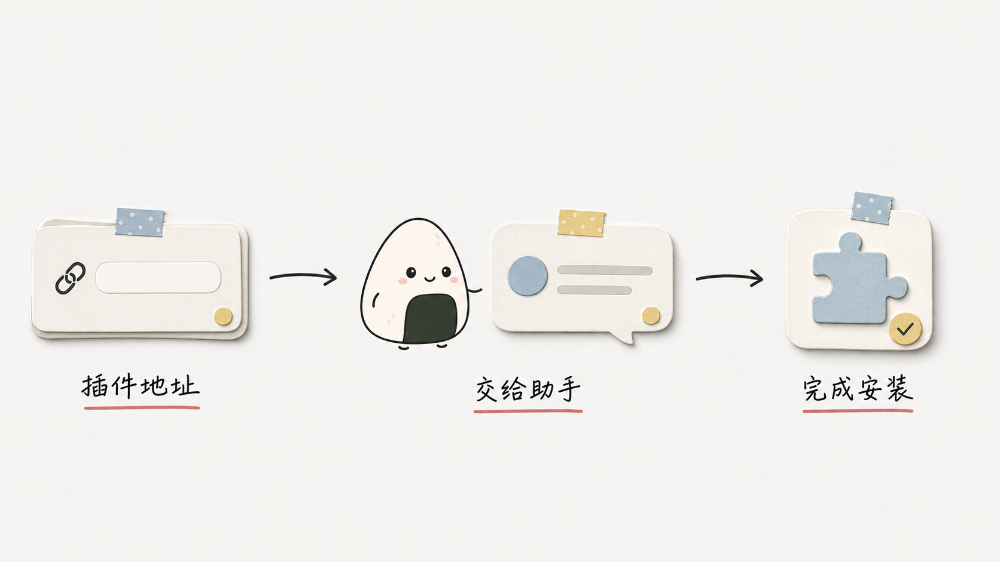
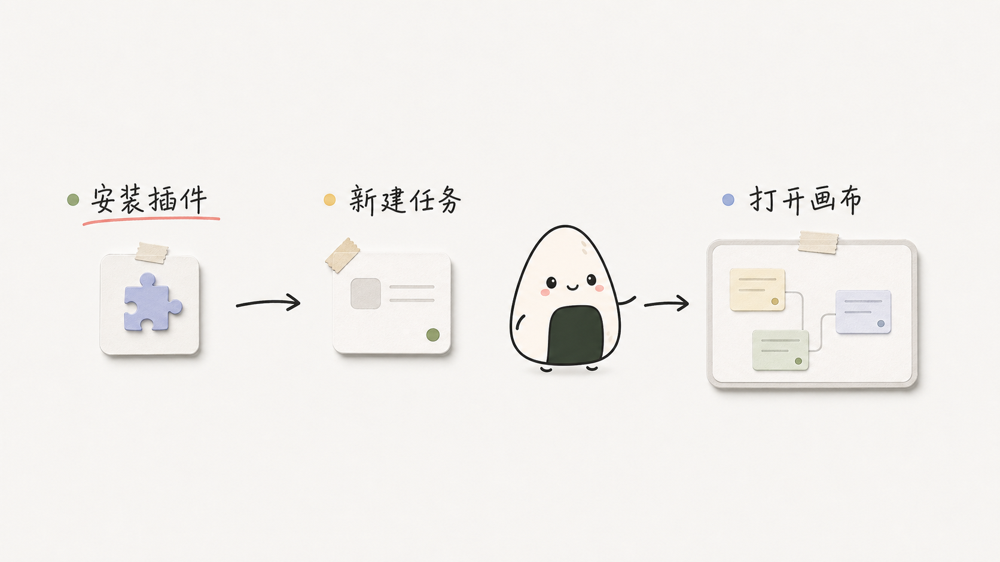
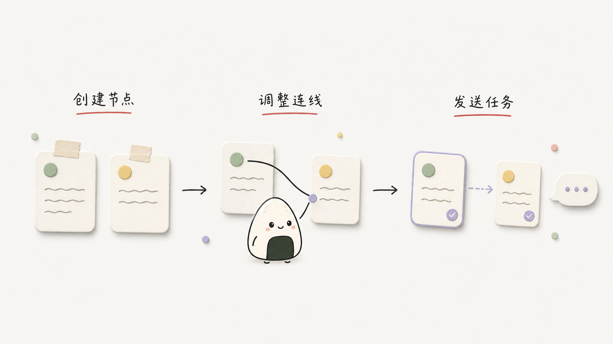
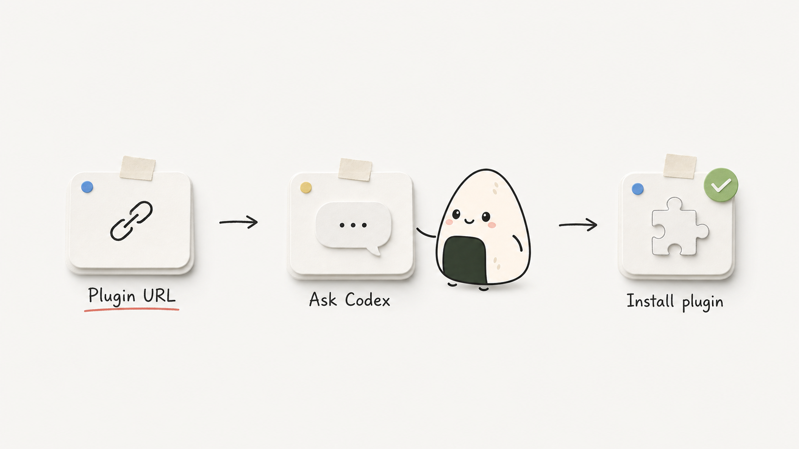
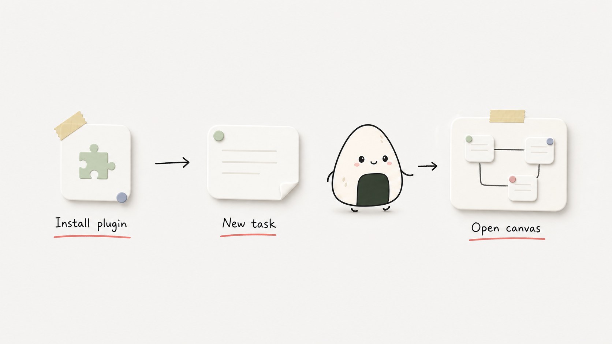
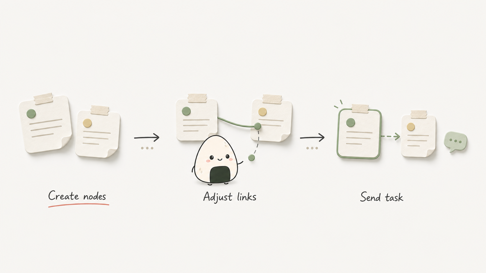

<div align="center">
  <a href="https://github.com/Niall-Young/Canvasight">
    
  </a>
  <h1>Canvasight</h1>
  <p><strong>专为 Codex 打造的可交互任务画布与提示词工作区</strong></p>
  <p><em>An Interactive Task Canvas & Prompt Workflow Workspace for Codex</em></p>

  <p>
    <a href="https://github.com/Niall-Young/Canvasight/releases"></a>
    <a href="LICENSE"></a>
    <a href="https://github.com/Niall-Young/Canvasight"></a>
    <a href="https://modelcontextprotocol.io/"></a>
    <a href="https://react.dev/"></a>
    <a href="https://www.typescriptlang.org/"></a>
    <a href="https://vitejs.dev/"></a>
    <a href="https://xyflow.com/"></a>
    <a href="https://github.com/Niall-Young/Canvasight/pulls"></a>
  </p>

  <p>
    <b>Language / 语言导航：</b>
    <a href="#-简体中文">🇨🇳 简体中文</a> &nbsp;|&nbsp;
    <a href="#-english">🇬🇧 English</a>
  </p>
</div>

---

<a id="中文"></a>
<a id="-简体中文"></a>
# 🇨🇳 简体中文

Canvasight 是一个专为 Codex 设计的插件，通过直观的可编辑节点画布，将任务、文件素材和提示词流程整理为 `Page → Group → Task/Asset` 层次结构，并直通 Codex 执行。

正式安装使用 Codex 管理的 Git 快照，不依赖桌面端源码仓库；仓库本身保留 repo-local 插件布局供本地开发调试。正常使用时，画布直接以内嵌形式渲染在 Codex 原生 Widget 中；项目级本地 Daemon 独立负责画布数据持久化与 API 交互，无需依赖单个任务会话常驻。

### 目录
- [许可证](#许可证)
- [核心特性](#核心特性)
- [快速上手](#快速上手)
- [多任务并发与协同编辑](#多任务并发与协同编辑)
- [原生 Widget 运行机制](#原生-widget-运行机制)
- [AI 写入画布](#ai-写入画布)
- [插件安装与更新](#插件安装与更新)
- [MCP Tools 说明](#mcp-tools-说明)
- [Skills 分工体系](#skills-分工体系)
- [数据持久化规范](#数据持久化规范)
- [开发与测试](#开发与测试)
- [原生验收标准](#原生验收标准)
- [常见问题解答 (FAQ)](#常见问题解答-faq)

---

### 许可证

Canvasight 采用 [MIT 许可证](LICENSE) 开源，Copyright (c) 2026 Niall Young。详情请参阅 [LICENSE](LICENSE)。

> **画布归属与 Run 运行绑定说明：**  
> 画布内容跟随项目目录，持久化存储于项目根目录下的 `.scatter/scatter.json`（附件位于 `.scatter/assets/`）；每次打开画布，则以**当前 Codex 任务**临时绑定 Native Widget 与 Run 运行通道。切换到新项目后，Canvasight 会重新解析该任务的项目目录并加载对应的 `.scatter`，不会串用历史项目的画布或旧任务作为 Run 目标。

---

### 核心特性

- **节点与资产驱动**：创建、拖拽、删除并连接任务节点（Task Node）与资产节点（Asset Node）。点击节点侧边加号或拖动连线至空白画布，唤出菜单快速选择新建 Task、文件或媒体节点；单选本地文件成功后即创建对应节点。每个节点可为独立的无前置根节点；一旦建立上游连接，严格遵循**单父节点**约束（保证执行逻辑确定），下游可继续发散分流。
- **一等媒体资产体验**：图片（含 SVG）和视频直接作为 Asset 呈现；选中时显示聚焦轮廓，视频保留原生播放/暂停、进度条、音量及全屏交互。其他格式文件以清晰的单层白底搭配对应 SVG 格式图标及大小展示。Asset 节点作为上下文证据伴随连线参与 Task/Group 运行，不可独立触发 Run。
- **语义化分组 (Group)**：支持使用 `⌘/Ctrl+G` 将多个节点打包成单层语义 Group，使用 `⌘/Ctrl+Shift+G` 解除分组。支持整组平移、一键按内容自适应尺寸、折叠卡片摘要，以及仅针对组内范围的聚焦 Run。
- **无工具栏沉浸富文本**：节点正文支持 Markdown 快捷键与即时排版渲染（标题、列表、粗体、代码块、引用等），底层完全保持标准 Markdown 字符串存储，全面兼容模板、预览、导出与 Run。
- **多页面工作区 (Pages)**：支持在同一项目下创建多个独立 Page，自由隔离架构设计、需求拆解、调试分析等不同场景。
- **多任务无锁并发**：支持在多个 Codex 任务中同时打开并编辑同一项目画布。非冲突修改自动合并，同对象并发冲突时自动保留完整的“AI 冲突副本”或“本地冲突副本”，绝不发生静默覆盖。
- **AI 对话式写图与生图**：输入自然语言或 `@Canvasight 生成……`，由 Codex 自动调用 `write_canvasight_graph` 输出清晰有向图；或联动内置图像生成 Skill，将多角度概念图/参考图直接以独立 Asset Node 导入至当前画布最右侧。
- **歧义确认卡片 (Framework Questions)**：架构梳理遇关键方向分歧时，在 Codex 消息流内直接展示内嵌确认卡片，无需跳转画布即可完成决策确认并自动继续流程。
- **本地模板与 Skill 联动**：内置本地全局节点模板库（支持最多 200 个模版）；节点正文中输入 `$` 即可联想搜索已启用的 Skill，亦可授权 AI 在写图时为职责明确的节点打上 `$skill-name` 标签。

---

### 快速上手

#### 1. 安装插件
复制以下指令发送给 Codex：

```text
帮我从 stable 分支安装这个 Codex plugin：https://github.com/Niall-Young/Canvasight.git
```

Codex 会自动完成 Marketplace 与插件的拉取配置。手动安装方法请参阅后文[插件安装与更新](#插件安装与更新)。

<div align="center">
  
</div>

#### 2. 重启并加载
插件安装或更新后，请**重新加载 Codex 窗口或重启 Codex 客户端**。进入目标项目，开启新的 Codex 任务，并在会话中输入 `@Canvasight`。

#### 3. 打开画布
在对话中发送以下提示词：

```text
@Canvasight 打开当前项目的 Canvasight 画布。请使用当前任务的项目目录，并在原生画布确认就绪后再告诉我。
```

<div align="center">
  
</div>

#### 4. 生成画布内容
画布启动后，根据实际工作场景直接向 Codex 发送提示词：

* **代码架构梳理**：
  ```text
  用 Canvasight 分析当前项目，并创建一个“代码架构”Page。按照真实目录、核心模块、数据流、接口、风险和验证方式拆成可编辑节点，用有实际含义的连线表达它们的关系。
  ```
* **产品需求拆解**：
  ```text
  用 Canvasight 把下面的产品需求创建成一个可执行的画布：包含产品目标、目标用户、核心流程、范围边界、设计方向、技术实现、风险和验收标准。请拆成可编辑节点，并用连线表示真实依赖关系。

  产品需求：
  [在这里粘贴你的需求描述]
  ```
* **整理技术资料或文章**：
  ```text
  用 Canvasight 把下面的内容整理成一个新的 Page。按照主题、章节、核心观点、证据、结论和待确认问题创建可编辑节点；只有存在真实包含、证据或依赖关系时才连接节点。

  内容：
  [在这里粘贴文章或资料文本]
  ```
* **直接生图到画布**：
  ```text
  @Canvasight 生成一张雨夜霓虹街道的电影感概念图，并直接放到当前画布。
  ```

#### 5. 增量修改与完善
```text
继续完善当前 Canvasight Page：请保留未提及的节点和位置，只更新与“[在这里填写要新增、调整或移除的要素]”相关的节点和连线。
```

#### 6. 刷新同步
若 AI 已确认完成写入，但画布未即时展现，点击画布右上角的**刷新**图标。Canvasight 会确保本地修改存盘后，加载项目最新版本并保留当前视口和选中项。

#### 7. 节点流转与执行
在画布中拖拽组织连线。双击节点正文开启富文本编辑；通过下方资产按钮或拖拽导入素材文件；选中多个节点 `⌘/Ctrl+G` 创建 Group。点击节点或 Group 的 **Run** 按钮，系统会精准将对应作用域及上下游 Asset 证据通过 Chat 发送给 Codex 立即执行。

<div align="center">
  
</div>

---

### 多任务并发与协同编辑

- **独立版本比对**：同一项目支持在多个 Codex 任务中同时开启。保存时以各任务最近确认的版本为基准进行三方比对，不同节点/连线的变动自动合并，无需加锁。
- **自动变基 (Rebase)**：若当前任务保存期间发生外部写入（如后台 AI 产出），响应文档会自动与本地待保存改动重基，杜绝后续编辑覆盖较新的 AI 节点。
- **冲突副本隔离**：当两人或任务修改了同一节点且无法协调时，系统保留先存者的原页面内容，并将后存者的完整 Page 另存为清晰标识的“冲突副本”Page，绝不静默丢失任何一方的数据。
- **AI 并发保护**：AI 在当前 Page 运行写图期间，用户可自由拖拽节点或编辑其他内容。已有节点保留用户最新手动坐标，AI 新增节点自动布局排布，发生碰撞时完整 AI 结果另存为“AI 冲突副本”。

---

### 原生 Widget 运行机制

- **启动状态机**：React Shell 在 Widget 挂载后以单向单调状态机驱动：`starting → connecting_bridge → connecting_session → hydrating_project → ready | failed`，杜绝状态倒流。
- **实例身份校验**：每个客户端生成全局唯一的 `widgetInstanceId`，仅当 `openAttemptId`、`sessionId` 与当前 `threadId` 严格三合一匹配且画布完全渲染可见时，才判定为 `ready` 状态。
- **安全沙箱代理**：Widget 绝不直接向 `localhost` 发起裸网络请求，一切 API 调用皆通过专属 MCP 工具 `canvasight_widget_api` 转发，保障安全边界。
- **Run 通信渠道**：原生运行走 MCP Apps `ui/message` 或 `window.openai.sendFollowUpMessage` 桥梁；外部浏览器 Fallback 页面仅作为调试通道，不具备原生主机桥梁能力。

---

### AI 写入画布

Codex 推荐优先调用 `write_canvasight_graph`，禁止直接手动覆写 `.scatter/scatter.json`：
1. **模式策略**：
   - 默认采用 `append-page` 新增独立 Page；
   - 局部追加或精细修改调用 `get_canvasight_graph_context` 后采用 `merge-active-page`；
   - 仅在用户明确要求完全重做当前页或全文档时，方可使用 `replace-active-page` 或 `replace-document`。
2. **规范约束**：
   - **水平拓扑**：所有 AI 自动生成及整理布局严格遵循从左到右的两层水平拓扑（Group / 独立节点分层横排，Group 内部成员水平排列）；
   - **单父节点**：严禁为一个节点建立多个上游入边；
   - **真实因果关系**：连线仅用于表达真实依赖、包含、证据、判定或流转关系，严禁将平级清单机械串联成单链。

---

### 插件安装与更新

#### 官方 Release 快照安装（推荐）
在终端中执行：
```bash
codex plugin marketplace add https://github.com/Niall-Young/Canvasight.git --ref stable
codex plugin add canvasight@canvasight-local
codex plugin list
```
*自 `v0.4.10` 起，发布包中已内置自包含的 MCP Server 依赖，通过 GitHub 安装后无需进入缓存目录执行 `npm install`。*

#### 本地开发安装 (Local Checkout)
若需对 Canvasight 进行二次开发，可直接引用本地仓库路径：
```bash
codex plugin marketplace add /你的绝对路径/Canvasight
codex plugin add canvasight@canvasight-local
codex plugin list
```

#### 检查更新
在 Codex 对话中直接输入：
```text
检查 Canvasight 更新
```
或
```text
更新 Canvasight
```
更新器将比对已安装版本与 GitHub 官方最新正式 Release，自动完成全套快照的无缝平滑替换。

---

### MCP Tools 说明

| 工具类别 | 工具名称 | 功能描述 |
| :--- | :--- | :--- |
| **原生打开与确认** | `open_canvasight` | 启动原生画布实例，返回 `opening` 凭据与 `openAttemptId` |
| | `await_canvasight_widget_ready` | 轮询等待 Widget 完成 React 挂载、数据水合与可见渲染 |
| | `ask_canvasight_framework_questions` | 在 Codex 对话流中内嵌 1~3 道决策单选/多选确认卡片 |
| | `open_canvasight_recent_project` | 在新任务中快速重开最近历史项目画布 |
| | `list_canvasight_recent_projects` | 查询最近使用过的 Canvasight 项目列表 |
| **画布与图元管理** | `get_canvasight_graph_context` | 读取当前 Page 结构、节点摘要、连线及修订版本号 |
| | `write_canvasight_graph` | 以受控事务提交图元的新建、合并、替换或重排 |
| | `list_canvasight_node_templates` | 列出本地全局节点模板库摘要 |
| | `get_canvasight_node_template` | 获取指定模板的完整节点定义及附件 |
| | `list_canvasight_skills` | 查询当前项目已启用 Skill 的安全摘要 |
| **调试与会话** | `open_canvasight_browser_fallback` | 打开基于浏览器的备用调试页面 |
| | `claim_canvasight_thread` | 将 Fallback 调试会话绑定至当前任务 |
| | `await_canvasight_run` | 提取 Fallback 队列中的待执行 Run 任务 |
| | `close_canvasight` | 关闭指定会话连接（不影响项目 Daemon） |

---

### Skills 分工体系

- **`canvasight-open`**：负责原生 Widget 调起、最近项目流转及 Fallback 接入。
- **`canvasight-run`**：负责原生 Chat Run 投递以及 Fallback 队列消费。
- **`canvasight-graph-writer`**：负责根据意图调用规范生成与维护画布图谱。
- **`canvasight-imagegen`**：负责验证画布、驱动图像模型生图并原子归集为 Asset Node。
- **`canvasight-agent-team`**：负责处理基于 `ROSTER.md` 与 `agent-reports/` 的多智能体协作协议。
- **`canvasight-update`**：负责版本比对以及通过 Marketplace 执行安全升级。
- **`canvasight-troubleshooting`**：负责环境探测、Daemon 排错与 MCP 链路诊断。

---

### 数据持久化规范

- **画布数据**：`.scatter/scatter.json`（支持多 Page、Group、Task 及 Asset 结构）。
- **附件资产**：`.scatter/assets/`（由系统受管存储，删除 Asset 节点不会物理删除源文件）。
- **修订记录**：`.scatter/revision-state.json`（记录版本历史与幂等变更凭据）。
- **全局偏好与模板**：保存在用户主目录下的 Canvasight 目录中，不污染具体项目。

---

### 开发与测试

在本地进入 `plugins/canvasight` 目录：

```bash
# 安装依赖
npm install

# 编译 MCP 打包产物
npm run build:mcp
npm run check:mcp-bundle

# 本地调试开发服务
npm run dev
npm run dev:status
npm run dev:stop

# 代码检查与单元测试
npm run typecheck
npm run test:unit
npm run test:architecture

# 核心全量测试矩阵
npm run test:core
npm run verify

# 打包构建
npm run build
```

---

### 原生验收标准

涉及 Native Widget 的交付必须经过严格的主机环境实机验收：
1. 安装对应版本插件并在 Codex Desktop 重启后开启全新任务；
2. 正常输入 `@Canvasight` 触发打开；
3. `await_canvasight_widget_ready` 返回 `verified: true`，且各阶段回执完整（React 挂载、项目水合、画布渲染可见且具有有效物理尺寸）；
4. 画布操作验证：创建 Task、导入媒体为 Asset、创建并折叠 Group；
5. 执行 Group Run，验证消息通过主机桥梁准确投递至当前任务对话流；
6. 验证乱序及延迟事件不会使就绪状态回退至 `Connecting`。

---

### 常见问题解答 (FAQ)

<details>
<summary><b>Q1: 界面卡在 Opening / Starting / Connecting 怎么办？</b></summary>
<br>
通过 <code>await_canvasight_widget_ready</code> 返回的诊断信息排查：
- <b>timeout</b>：Widget 未在超时前完成就绪握手，请排查 MCP Lifecycle 日志与 Node 执行环境；
- <b>failed</b>：查看面板标明的失败 Stage，定位是 React 渲染故障、会话握手阻断还是视口不可见；
- 单纯看到 Connecting 仅代表桥梁接收到元数据，不代表 API 通信完成。
</details>

<details>
<summary><b>Q2: 移动或删除源码目录后找不到插件？</b></summary>
<br>
说明之前使用了本地 checkout 开发安装。请清理旧注册后切换为官方 stable 分支的快照安装：
<pre><code>codex plugin remove canvasight@canvasight-local
codex plugin marketplace remove canvasight-local
codex plugin marketplace add https://github.com/Niall-Young/Canvasight.git --ref stable
codex plugin add canvasight@canvasight-local</code></pre>
</details>

<details>
<summary><b>Q3: Windows 下安装后看不到 Canvasight 相关 Tools？</b></summary>
<br>
1. 使用 <code>tool_search</code> 检索 <code>canvasight open_canvasight</code>；<br>
2. 使用 <code>codex.cmd plugin list</code> 验证版本是否处于 <code>0.4.10</code> 及以上（新版本已内置完整依赖）；<br>
3. 在插件目录运行 <code>node .\tests\mcp-registration-probe.mjs</code> 进行注册握手诊断。
</details>

<details>
<summary><b>Q4: 导入的文件会变成 Task 附件还是 Asset Node？</b></summary>
<br>
所有新导入文件（拖放、粘贴、文件选择）一律作为一等公民 <b>Asset Node</b> 创建。图片与视频直接呈现预览卡片，其他格式显示标准文件卡。旧项目已有的 Task 附件完全兼容，支持在菜单中一键“提升为资产节点”。
</details>

<details>
<summary><b>Q5: Group Run 与 普通 Run 有何不同？</b></summary>
<br>
- <b>Task Run</b>：沿连接线向后遍历，将下游全部子任务及关联的 Asset 文件证据一并交付执行；<br>
- <b>Group Run</b>：严格限定在 Group 边界内，仅打包组标题、说明、直属成员、成员资产与组内内部连线，绝不沿跨组连线带出外部节点。
</details>

<br />

---

<a id="english"></a>
<a id="-english"></a>
# 🇬🇧 English

Canvasight is an interactive canvas plugin designed for Codex. It organizes tasks, media materials, and prompt flows into a clean `Page → Group → Task/Asset` hierarchy on an infinite canvas before handing them off to Codex for execution.

Standard installations use a Git snapshot managed by Codex without needing a desktop source checkout; the repository retains a repo-local plugin structure for active development. In normal workflows, the canvas renders directly inside a Codex Native Widget. A project-level local daemon handles data persistence and JSON APIs independently of any transient task lifetime.

### Table of Contents
- [License](#license)
- [Key Features](#key-features)
- [Quick Start](#quick-start)
- [Multi-Task Concurrency & Collaboration](#multi-task-concurrency--collaboration)
- [Native Widget Architecture](#native-widget-architecture)
- [AI Graph Writing](#ai-graph-writing)
- [Plugin Installation & Updates](#plugin-installation--updates)
- [MCP Tools Reference](#mcp-tools-reference)
- [Skills Ecosystem](#skills-ecosystem)
- [Data Storage Specification](#data-storage-specification)
- [Development & Testing](#development--testing)
- [Native Verification Acceptance](#native-verification-acceptance)
- [Frequently Asked Questions (FAQ)](#frequently-asked-questions-faq)

---

### License

Canvasight is open source software licensed under the [MIT License](LICENSE), Copyright (c) 2026 Niall Young. See the [LICENSE](LICENSE) file for complete terms.

> **Canvas Ownership & Run Dispatch Binding:**  
> Canvas content follows the project directory, persisting into `.scatter/scatter.json` (with attachments in `.scatter/assets/`). Each open temporarily binds the Native Widget and Run targeting to the **current Codex task**. Switching projects causes Canvasight to resolve the target task's project directory freshly, ensuring canvases and task recipients never bleed across workspaces.

---

### Key Features

- **Task & Asset Node Topology**: Create, drag, connect, and delete Task Nodes and Asset Nodes. Clicking the side plus handles or dragging an edge to open canvas summons a quick creation menu (Task, File, Media). Every node can be a root; once connected as a child, it strictly enforces a **single-parent invariant** while allowing multiple downstream branches.
- **First-Class Media Assets**: Images (including SVG) and videos appear directly as visible Asset content; selecting them displays a focus contour without disturbing handles. Videos provide native playback, scrub bar, volume, and fullscreen controls. Files render on a clean white surface with their respective SVG format icon and size metadata. Assets supply contextual evidence to Task/Group Runs without executing alone.
- **Semantic Groups**: Group multiple nodes with `Cmd/Ctrl+G` and ungroup with `Cmd/Ctrl+Shift+G`. Groups support cohesive dragging, single-click "Fit to Content", collapsible summary badges, and group-scoped Runs.
- **Toolbarless Rich-Text Markdown**: Enjoy frictionless in-place rich text editing powered by standard Markdown shortcuts (headers, lists, blockquotes, inline/fenced code). Files remain purely stored as standard Markdown strings, preserving compatibility across templates, previews, exports, and Runs.
- **Multi-Page Workspaces**: Isolate architectures, user flows, design drafts, or bug explorations across independent Pages within the same project.
- **Lock-Free Concurrency**: Open and edit the same project simultaneously across multiple Codex tasks. Independent changes merge automatically; irreconcilable conflicts generate complete, non-destructive "Conflict Copies".
- **AI Graph Writing & Image Generation**: Use natural language prompts or `@Canvasight Generate…` to let Codex construct structured editable graphs or automatically import generated conceptual imagery as Asset Nodes positioned on the far right.
- **Framework Clarification Cards**: Resolves pivotal architectural ambiguities directly inside the Codex conversation stream using compact inline multi-choice cards, eliminating unnecessary canvas popups.
- **Templates & Skill Integrations**: Store up to 200 local node templates. Type `$` in any node body to search project Skills, or allow AI to tag responsibilities with `$skill-name`.

---

### Quick Start

#### 1. Install Plugin
Send the following message to Codex:

```text
Help me install this Codex plugin from the stable branch: https://github.com/Niall-Young/Canvasight.git
```

Codex will configure the marketplace and plugin automatically. For manual CLI installation, see [Plugin Installation & Updates](#plugin-installation--updates).

<div align="center">
  
</div>

#### 2. Reload Codex
After installation or updates, **reload the Codex window or restart Codex Desktop completely**. Open your target project, start a new task, and reference `@Canvasight`.

#### 3. Open the Canvas
Send this prompt in your Codex conversation:

```text
@Canvasight Open the Canvasight canvas for the current project. Please use the project directory of this task and inform me once the native canvas is verified ready.
```

<div align="center">
  
</div>

#### 4. Generate Canvas Workflows
Once open, pick a prompt suited to your task:

* **Codebase Architecture**:
  ```text
  Analyze the current project with Canvasight and create a "Code Architecture" Page. Break it down into editable nodes reflecting real directories, modules, data flows, APIs, risks, and validation, connected with meaningful edges.
  ```
* **Product Requirements**:
  ```text
  Use Canvasight to convert the following PRD into an executable canvas: include goals, personas, core flows, boundaries, technical specs, risks, and acceptance criteria. Connect real dependencies with directed edges.

  PRD:
  [Paste your requirements here]
  ```
* **Research & Knowledge Synthesis**:
  ```text
  Organize the following material into a new Canvasight Page. Decompose by topics, chapters, arguments, evidence, conclusions, and open items; only connect nodes with genuine evidence or dependency relations.

  Content:
  [Paste reference material here]
  ```
* **Direct Image Generation**:
  ```text
  @Canvasight Generate a cinematic concept image of a rainy neon city street and place it directly onto the current canvas.
  ```

#### 5. Incremental Refinement
```text
Continue refining the active Canvasight Page: keep all unmentioned nodes and positions intact, and only modify nodes and edges related to "[describe specific additions, updates, or removals]".
```

#### 6. Synchronize Canvas State
If AI generation has completed but the canvas has not refreshed, click the **Refresh** icon in the upper-right corner. Canvasight ensures local changes are persisted before fetching the newest project state while preserving current viewport and selection.

#### 7. Edit, Connect, and Run
Drag nodes to adjust layouts. Click a node body to enter seamless rich-text editing. Drop files or media directly to spawn Asset Nodes. Group related items using `Cmd/Ctrl+G`. Click **Run** on any Task or Group to send the exact scoped workflow and attached Asset evidence to Codex.

<div align="center">
  
</div>

---

### Multi-Task Concurrency & Collaboration

- **Three-Way Document Rebase**: Different Codex tasks can work on the same project simultaneously. Local and external mutations undergo three-way comparisons; modifications to disparate nodes or edges merge automatically without coarse file locks.
- **Client Auto-Rebase**: Incoming saves reconcile both revision and document state. If an external AI write occurred in the background, local pending edits rebase cleanly on top of the fresh state.
- **Non-Destructive Conflict Copies**: When two tasks modify the same node concurrently, the earlier save holds the original Page, while the later task preserves its entire canvas into an explicit "Conflict Copy" Page.
- **Safe AI Ingestion**: During an active AI graph write, user drags and node edits on the original Page take precedence. Validated AI candidate graphs are rebased or preserved as identifiable "AI Conflict Copies" without overwriting manual work.

---

### Native Widget Architecture

- **Deterministic Startup Machine**: The React shell mounts on frame one and advances through a monotonic state machine: `starting → connecting_bridge → connecting_session → hydrating_project → ready | failed`.
- **Instance Verification**: Every client assigns a distinct `widgetInstanceId`. The canvas is acknowledged as `ready` only when `openAttemptId`, `sessionId`, and `threadId` match and the fullscreen instance reports verified dimensions and complete React hydration.
- **Secure Sandbox Proxying**: The widget never performs direct fetches against `localhost`. All JSON calls route through the allowlisted `canvasight_widget_api` MCP tool.
- **Host Bridge Communication**: Native Run actions dispatch through MCP Apps `ui/message` or `window.openai.sendFollowUpMessage` host bridge transports. Browser fallback surfaces operate strictly as dev fallbacks.

---

### AI Graph Writing

Codex agents interact with Canvasight through `write_canvasight_graph` rather than modifying raw `.scatter/scatter.json` files:
1. **Mode Selection**:
   - `append-page` (default): Appends a new Page to preserve existing work;
   - `merge-active-page`: Reads `get_canvasight_graph_context` and submits surgical operations with a stable `clientMutationId`;
   - `replace-active-page` / `replace-document`: Reserved strictly for explicit user rewrite requests.
2. **Topological Rules**:
   - **Horizontal Hierarchy**: All AI layouts strictly organize left-to-right (Groups and root nodes horizontally partitioned, Group members horizontally aligned internally);
   - **Single-Parent Rule**: Every target node admits exactly one incoming edge;
   - **Meaningful Connectivity**: Edges express genuine causal, evidence, sequence, or containment relationships rather than arbitrary linear chaining.

---

### Plugin Installation & Updates

#### Official Release Installation (Recommended)
Run the following commands in your shell:
```bash
codex plugin marketplace add https://github.com/Niall-Young/Canvasight.git --ref stable
codex plugin add canvasight@canvasight-local
codex plugin list
```
*Starting with `v0.4.10`, the published MCP server bundle is completely self-contained; no manual `npm install` inside plugin cache directories is required.*

#### Local Checkout Development
To develop Canvasight locally, register the local repository directory:
```bash
codex plugin marketplace add /your/absolute/path/to/Canvasight
codex plugin add canvasight@canvasight-local
codex plugin list
```

#### Checking for Updates
Ask Codex directly:
```text
Check Canvasight updates
```
or
```text
Update Canvasight
```
The updater inspects GitHub Latest Releases, verifies Git refs against `stable`, and performs an atomic plugin snapshot replacement without touching project workspace data.

---

### MCP Tools Reference

| Category | Tool | Description |
| :--- | :--- | :--- |
| **Native Open & Ready** | `open_canvasight` | Launches native canvas widget; returns provisional `opening` tokens |
| | `await_canvasight_widget_ready` | Waits for verified fullscreen React mount, hydration, and visible render |
| | `ask_canvasight_framework_questions` | Displays 1–3 inline choice cards directly in Codex chat stream |
| | `open_canvasight_recent_project` | Reopens a recently accessed project canvas in a new task |
| | `list_canvasight_recent_projects` | Lists recently active Canvasight projects |
| **Graph & Templates** | `get_canvasight_graph_context` | Retrieves active Page topology, node digests, edges, and document revision |
| | `write_canvasight_graph` | Atomically commits additions, merges, replacements, or relayouts |
| | `list_canvasight_node_templates` | Summarizes available local node templates |
| | `get_canvasight_node_template` | Reads complete template node definition and assets |
| | `list_canvasight_skills` | Queries sanitized summaries of enabled project Skills |
| **Diagnostics & Fallback**| `open_canvasight_browser_fallback` | Launches local browser fallback page for diagnostics |
| | `claim_canvasight_thread` | Binds a fallback browser session to the current Codex task |
| | `await_canvasight_run` | Polls and claims queued Run payloads from fallback sessions |
| | `close_canvasight` | Closes a canvas session without stopping the shared project daemon |

---

### Skills Ecosystem

- **`canvasight-open`**: Handles native widget bootstrap, recent project switching, and fallback routing.
- **`canvasight-run`**: Manages native Chat Run dispatching and fallback queue processing.
- **`canvasight-graph-writer`**: Formulates structured, validated node and edge graph layouts.
- **`canvasight-imagegen`**: Generates conceptual bitmap artwork and atomically imports Asset Nodes.
- **`canvasight-agent-team`**: Coordinates multi-agent workflows backed by `ROSTER.md` and `agent-reports/`.
- **`canvasight-update`**: Checks releases and installs official updates through marketplace mechanisms.
- **`canvasight-troubleshooting`**: Diagnoses MCP transports, daemon lifecycles, and widget states.

---

### Data Storage Specification

- **Project Graph**: `.scatter/scatter.json` (stores Pages, Groups, Tasks, and Asset Nodes).
- **Project Assets**: `.scatter/assets/` (managed asset store; deleting nodes never deletes underlying files).
- **Revision History**: `.scatter/revision-state.json` (persists mutation receipts and revision history).
- **Global User Preferences**: Stored in `~/.canvasight/` (templates, daemon state, logs).

---

### Development & Testing

From `plugins/canvasight`:

```bash
# Install dependencies
npm install

# Build & check MCP server bundle
npm run build:mcp
npm run check:mcp-bundle

# Local dev server
npm run dev
npm run dev:status
npm run dev:stop

# Type checking and unit tests
npm run typecheck
npm run test:unit
npm run test:architecture

# Core test matrix verification
npm run test:core
npm run verify

# Production build
npm run build
```

---

### Native Verification Acceptance

Any modifications affecting the Native Widget must satisfy the complete host acceptance gate:
1. Install the target plugin build and restart Codex Desktop before initiating a fresh task;
2. Request `@Canvasight` to trigger native opening;
3. Confirm `await_canvasight_widget_ready` returns `verified: true` with complete fullscreen React hydration and non-zero dimensions;
4. Perform core interactions: create a Task Node, drop a media file to create an Asset Node, form a Group, and test collapse/expand;
5. Trigger Group Run and verify that only the contained group scope is dispatched to the active Codex conversation via the native host bridge;
6. Confirm out-of-order or late metadata events cannot regress the UI state back to `Connecting`.

---

### Frequently Asked Questions (FAQ)

<details>
<summary><b>Q1: What should I do if the widget stays stuck on Opening / Starting / Connecting?</b></summary>
<br>
Inspect the result from <code>await_canvasight_widget_ready</code>:
- <b>timeout</b>: The widget failed to emit a ready receipt before the timeout. Check the MCP lifecycle logs and ensure Node is accessible;
- <b>failed</b>: Review the specific <code>stage</code> in the error report to isolate whether the failure occurred during React mounting, session bridge connection, or canvas rendering;
- A <code>Connecting</code> label only indicates bridge receipt of metadata, not verified API readiness.
</details>

<details>
<summary><b>Q2: Why did the plugin disappear after moving or deleting the source repo?</b></summary>
<br>
This indicates the plugin was installed via a local repository path checkout. Switch to the official self-contained <code>stable</code> snapshot:
<pre><code>codex plugin remove canvasight@canvasight-local
codex plugin marketplace remove canvasight-local
codex plugin marketplace add https://github.com/Niall-Young/Canvasight.git --ref stable
codex plugin add canvasight@canvasight-local</code></pre>
</details>

<details>
<summary><b>Q3: Missing Canvasight tools on Windows after installation?</b></summary>
<br>
1. Run <code>tool_search</code> for <code>canvasight open_canvasight</code>;<br>
2. Run <code>codex.cmd plugin list</code> to ensure the version is <code>0.4.10</code> or newer (which bundles all required dependencies);<br>
3. Execute <code>node .\tests\mcp-registration-probe.mjs</code> inside the plugin directory to diagnose MCP registration.
</details>

<details>
<summary><b>Q4: Do imported files become Task attachments or Asset Nodes?</b></summary>
<br>
All newly imported files (via drag-and-drop, paste, or the file picker) become standalone <b>Asset Nodes</b>. Images and videos render visual previews, while other formats display clean document cards. Existing legacy task attachments remain fully backward-compatible and can be promoted to Asset Nodes via their context menu.
</details>

<details>
<summary><b>Q5: How does a Group Run differ from a standard Task Run?</b></summary>
<br>
- <b>Task Run</b>: Follows downstream outgoing edges to compile all subsequent child tasks and their referenced Asset evidence into the execution payload;<br>
- <b>Group Run</b>: Strictly bounded by the Group container. Dispatches only direct members, internal edges, and member assets, never escaping outward across boundary edges.
</details>

<br />

---

## 📄 开源协议 / License

Canvasight is open source software released under the **[MIT License](LICENSE)**.  
Canvasight 遵循 **[MIT 开源许可证](LICENSE)**。

```text
MIT License

Copyright (c) 2026 Niall Young

Permission is hereby granted, free of charge, to any person obtaining a copy
of this software and associated documentation files (the "Software"), to deal
in the Software without restriction, including without limitation the rights
to use, copy, modify, merge, publish, distribute, sublicense, and/or sell
copies of the Software, and to permit persons to whom the Software is
furnished to do so, subject to the following conditions:

The above copyright notice and this permission notice shall be included in all
copies or substantial portions of the Software.

THE SOFTWARE IS PROVIDED "AS IS", WITHOUT WARRANTY OF ANY KIND, EXPRESS OR
IMPLIED, INCLUDING BUT NOT LIMITED TO THE WARRANTIES OF MERCHANTABILITY,
FITNESS FOR A PARTICULAR PURPOSE AND NONINFRINGEMENT. IN NO EVENT SHALL THE
AUTHORS OR COPYRIGHT HOLDERS BE LIABLE FOR ANY CLAIM, DAMAGES OR OTHER
LIABILITY, WHETHER IN AN ACTION OF CONTRACT, TORT OR OTHERWISE, ARISING FROM,
OUT OF OR IN CONNECTION WITH THE SOFTWARE OR THE USE OR OTHER DEALINGS IN THE
SOFTWARE.
```
